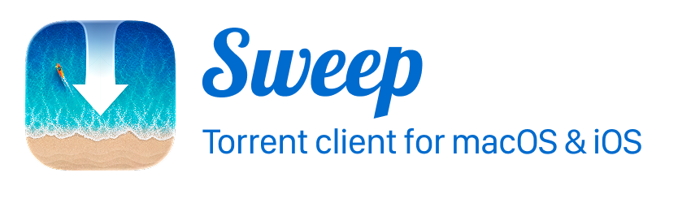

# Sweep

Sweep is a native Apple-platform torrent client built with Swift, SwiftUI, AppKit/UIKit where useful, and a Rust bridge around [`rqbit`](https://github.com/ikatson/rqbit).

The project is intentionally small and native. The macOS app follows the compact classic torrent-client shape: a dense torrent list, toolbar actions, progress detail, and a separate inspector panel. The iOS app shares the same core model and rqbit bridge so we can validate the Rust engine on device while building toward feature parity.

## Targets

- `Sweep`: macOS app.
- `Sweep-iOS`: iOS app.
- `SweepCore`: shared torrent model, persistence, formatting, and store logic.
- `SweepRQBitBridge`: Swift-facing bridge generated from the Rust `sweep-rqbit` crate.
- `rust/sweep-rqbit`: UniFFI-backed Rust wrapper around rqbit.

## Requirements

- Xcode 27.0 Release Candidate (27A266a, Swift 6.4), the currently tested toolchain.
- XcodeGen.
- Rust installed with `rustup`. `rust-toolchain.toml` pins the tested compiler and
  the five Apple targets used by the Rust bridge.
- An Apple Development signing identity for signed app/device builds.

Xcode 26.5 (Swift 6.3.2) was previously verified. Xcode 27 Beta 2 failed to
compile Swift Collections 1.7.1 (`Span.BorrowingIterator` errors), but Xcode
27.0 Release Candidate builds both apps successfully. Switching Swift compiler
versions can select different dependency manifests and change `Package.resolved`;
resolve and test the dependencies again when changing toolchains. The current
Swift 6.4 lockfiles select `swift-issue-reporting` 2.1.1 in place of
`xctest-dynamic-overlay` 1.13.1 through those dependency manifests.

## Set Up a New Mac

Install Xcode, launch it once to install its components, and select it in
Xcode's Settings > Locations > Command Line Tools. Install the other tools:

```sh
brew install xcodegen rustup
rustup-init -y --no-modify-path
export PATH="$HOME/.cargo/bin:$PATH"
```

Clone and prepare the project:

```sh
git clone https://github.com/nikstar/sweep.git
cd sweep
xcodegen generate
Scripts/build_rust_bridge.sh
swift test
```

The first Rust build downloads the pinned rqbit checkout, applies Sweep's
tracked patches, builds all five architectures, creates
`BuildArtifacts/SweepRustFFI.xcframework`, and regenerates the Swift/C bindings.
This first build takes several minutes. `references/`, `rust/target/`,
`BuildArtifacts/`, and Swift/Xcode caches are generated locally; they do not need
to be copied from the old laptop.

Open `Sweep.xcodeproj` and choose the `Sweep` or `Sweep-iOS` scheme. Sign into
your Apple account in Xcode for device testing. The app targets use automatic
signing with team `6RX8GEVB43`; change the team in `project.yml` and regenerate
the project if needed. Signing certificates and provisioning profiles are not
stored in Git.

Application state and downloaded files are separate from the source repository.
To preserve macOS torrent sessions, quit Sweep and migrate
`~/Library/Application Support/Sweep/` and the payload download folders separately.
Do not put that database or signing credentials in the public Git repository.

## Build and Test

Run shared model, persistence, and formatting tests:

```sh
swift test
```

Build both apps without requiring a signing identity:

```sh
xcodebuild -project Sweep.xcodeproj -scheme Sweep -configuration Debug -destination 'platform=macOS' CODE_SIGNING_ALLOWED=NO build
xcodebuild -project Sweep.xcodeproj -scheme Sweep-iOS -configuration Debug -destination 'generic/platform=iOS' CODE_SIGNING_ALLOWED=NO build
```

Build for an iOS simulator:

```sh
xcodebuild -project Sweep.xcodeproj -scheme Sweep-iOS -configuration Debug -destination 'generic/platform=iOS Simulator' CODE_SIGNING_ALLOWED=NO build
```

Remove `CODE_SIGNING_ALLOWED=NO` for a signed build. Regenerate the Xcode project
with `xcodegen generate` after changing `project.yml`.

After `swift test` has fetched the packages, command-line Xcode builds can reuse
those checkouts with `-clonedSourcePackagesDirPath "$PWD/.build"`. Add
`-onlyUsePackageVersionsFromResolvedFile` to require the committed Swift pins.

Both apps link the Rust static archives from the generated XCFramework. The
shared Swift modules are local Swift package products; there are no embedded
internal bridge frameworks or Rust dylibs in the app bundles. TLS uses rustls.

When Xcode is launched from Finder, it may not inherit your shell `PATH`. The build phase calls `Scripts/build_rust_bridge.sh`, which checks common Cargo locations such as `~/.cargo/bin/cargo`, `/opt/homebrew/bin/cargo`, and `/usr/local/bin/cargo`.

Swift dependencies are recorded in `Package.resolved`; Rust dependencies are
recorded in `rust/sweep-rqbit/Cargo.lock`. The bridge script uses `--locked` so a
normal build cannot silently change Rust dependency versions. Dependency updates
should be followed by shared tests and builds of both apps.

## Rust Patches

Sweep uses rqbit revision `f9b4aee85aff0fe52e206cfa3d3d5cc7e7d24947` under
`references/rqbit`. The checkout is ignored by Git because it is upstream source,
but the changes we rely on are tracked in this repo:

- `rust/patches/rqbit-tracker-compat.patch`
- `rust/patches/rqbit-piece-snapshot.patch`
- `rust/patches/rqbit-inspector-stats.patch`
- `rust/patches/rqbit-delete-file-errors.patch`
- `rust/patches/librqbit-dualstack-sockets/`

The build script creates the checkout when it is missing, verifies its revision,
and applies missing patches. An incomplete checkout or a different revision
causes an explicit error. Move a damaged checkout aside and rebuild to download
a fresh one. Update the revision and patches together when upgrading rqbit;
`SWEEP_RQBIT_REVISION` is available for explicit local experiments.

## Project State

- macOS 15+: compact torrent list, configurable columns, transfer controls,
  persisted sessions, and file/tracker/peer inspectors.
- iOS 26+, iPhone only: shared engine and persistence, magnet links, torrent
  document opening, file inspection, background download modes, and Live Activities.
- Remaining UI/engine work is tracked in [docs/FEATURES.md](docs/FEATURES.md).
- Distribution is through GitHub; App Store distribution is not a project goal.

The apps are Xcode targets. SwiftPM builds the shared libraries and tests, not an
app executable. macOS reports engine initialization failure explicitly and keeps
the saved session visible. iOS still has a demo-engine fallback. Successful
compilation alone does not prove public-swarm transfers work.

Verified on October 3, 2026 with Xcode 27.0 Release Candidate (27A266a) and Rust
1.99.0, starting without local Swift packages, rqbit sources, or Rust artifacts:

- All seven shared tests pass.
- macOS and unsigned iOS device builds pass.
- macOS launches successfully, and Settings confirms the active engine is rqbit.
- The bridge bootstraps the pinned rqbit checkout and builds all five Apple
  architectures; regenerated Swift/C bindings are unchanged.
- The iOS bundle remains iPhone-only, targets iOS 26, and includes the Live
  Activity extension.
- Swift 6.4 reports a non-blocking capture-ownership warning in
  `IOSBackgroundDownloadService`; App Intents metadata warnings also remain.

This pass did not run the iOS app or validate live transfers and background
downloads on a physical device.

Previously verified on October 2, 2026 with Xcode 26.5 and the pinned Rust toolchain:

- All seven shared tests pass.
- macOS and iOS device builds pass, including a signed iOS build.
- The iOS simulator build installs and launches successfully.
- Rust artifacts rebuild from an empty `BuildArtifacts/` and Rust target cache.
- The iOS app contains no embedded internal frameworks or Rust dylibs.
- A fresh GitHub checkout bootstraps all Rust artifacts, passes the shared tests,
  and builds the iOS app with fresh Xcode derived data.

Live downloading is not yet revalidated: an Arch trackerless torrent found no
peers within two minutes, and a Debian tracker connection timed out. The existing
`live_probe` command now reports tracker errors on failure. Test on a network with
working BitTorrent connectivity before relying on transfers or background modes:

```sh
cargo run --locked --manifest-path rust/sweep-rqbit/Cargo.toml --bin live_probe -- /path/to/test.torrent /tmp/sweep-transfer-test 1048576 120
```

The probe also accepts a text file containing a magnet link. Its time limit
applies separately to metadata discovery and the transfer phase. Set
`RUST_LOG=librqbit=debug,librqbit_tracker_comms=debug,warn` to inspect peer
handshakes and tracker failures; diagnostic logs contain peer addresses and
should remain local.

The October 3 macOS lifecycle pass added durable pending magnets, explicit
metadata cancellation and a 90-second discovery timeout, independent session
restoration, cached torrent metadata, and a Session Health popover. Swift
lifecycle tests cover pending/paused restoration, file selection, stale polling,
error visibility, and removal races. Rust tests transfer a synthetic 1 MiB file
over loopback, verify its contents, restore it from cached metadata, and cancel
a stalled discovery request without using a public tracker:

```sh
cargo test --locked --manifest-path rust/sweep-rqbit/Cargo.toml --lib
```

See [the macOS validation findings](docs/FEATURES.md#macos-validation-october-3-2026)
for the public-swarm result and remaining priorities.

Use a new, empty output directory so existing verified pieces cannot make the
probe succeed without downloading. Physical iPhone installation timed out while
establishing the device connection, including a retry with Xcode 27 tools. Startup
still needs a connected, unlocked device and Xcode support for its installed iOS
version; the signed build alone does not verify it.

The October 2026 refresh recovered the `sweep` working tree and history from an
identical `sweep-clone` checkout. That second directory had no newer source
changes. Its older device-build stash is preserved in Git as
`archive/april-device-probe`; it is historical code, not the current build setup.

## License

Sweep is licensed under the GNU General Public License v3.0. See [LICENSE](LICENSE).
